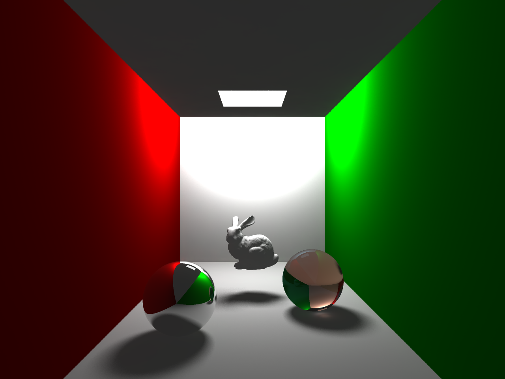
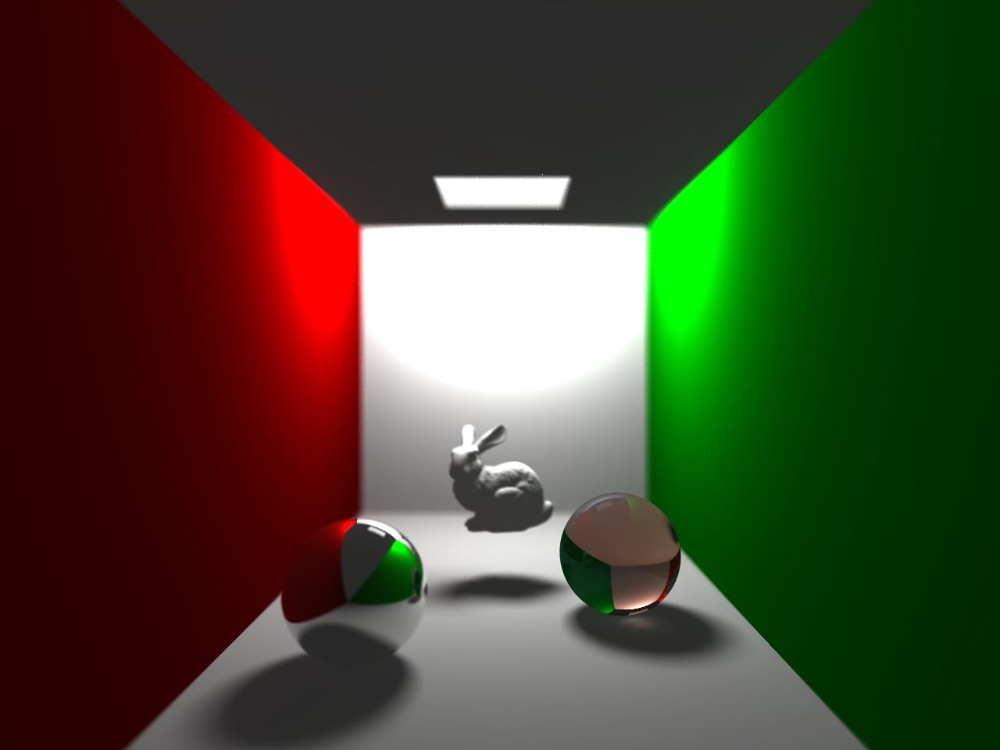

# Hitate
#### 光线跟踪大作业

---

# 效果图

这是使用Pinhole camera，应用了2xSSAA的效果图。

这张图使用Monte Carlo模拟了镜头光圈的效果。与第一张图对比，这张图的景深效果非常明显。

图中的兔子模型为Stanford Bunny模型。

# 代码功能

hutils.h:
- HVec3 3D向量类。
- HColor 颜色类。
- HRay 射线类。

hcamera.h:
- HCamera 照相机类。代码中实现了HPinholeCamera和HApertureCamera。

hmaterial.h:
- HMaterial 材质类。

hobject.h:
- HObject 有碰撞体积的物体对象类。
    - HSphere 球类。
    - HPlane 平面类。
- HIntersection 碰撞器类，用于描述射线与物体相交的结果。

hobjectunion.h:
- HObjectUnion 物体组织结构。
    - HObjectVector 包装了std::vector，便于进行查询。

hlightsource.h:
- HLightSource 光源类，继承自HObject。
    - HPointLightSource 点光源类。
    - HAreaLightSource 面光源类。

hscene.hpp, hraytracer.hpp:
- HScene 场景类，包含了所有的光源、物体以及照相机。
- HRaytracer 继承自HScene。在HScene之上还包括了运行时RT/PM所需的其他参数，如软阴影系数、光子发射及采样系数等等，并实现了PM的主体逻辑。

hphoton.h:
- HPhoton 光子类。
- HPhotonMap 光子映射类，封装了KDTree结构用于存储光子映射的结果。
- HNPhotons k近邻光子组织，用于描述photonmap查询的结果。

hpoly.h, htriangle.h, htriangleunion.h:
- HTriangle 三角形类，继承自HObject。
- HTriangleUnion 三角形组织类，封装了KDTree结构。
- HPoly 三角贴片模型类、

本代码使用了OpenCV以进行图片存储和并行加速.